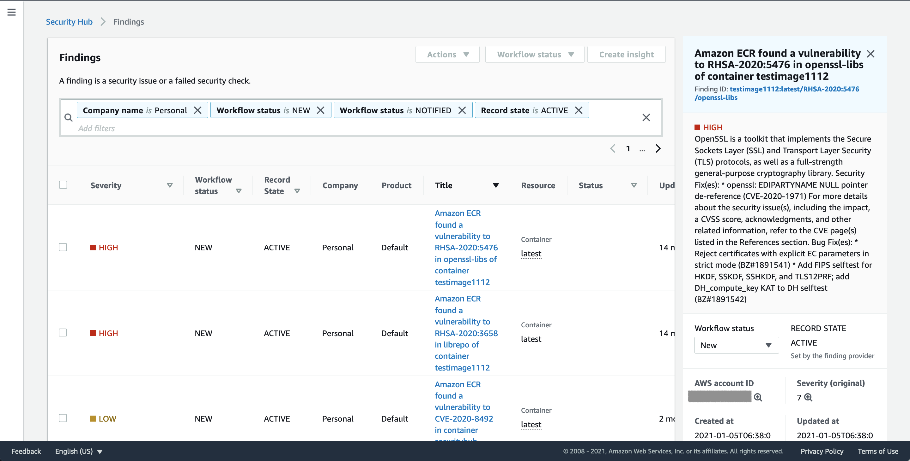
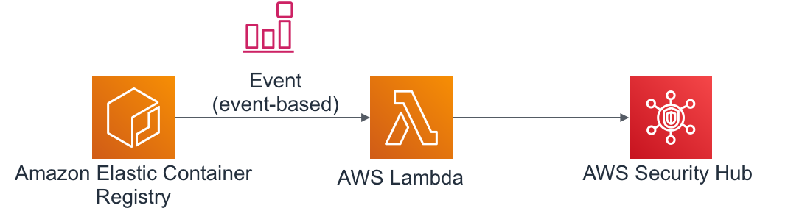
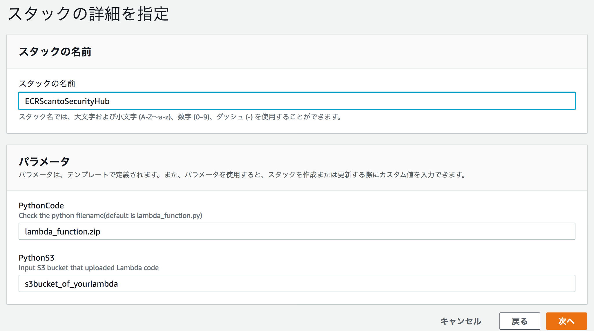
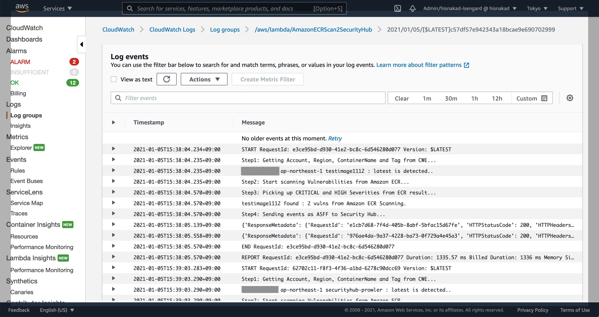
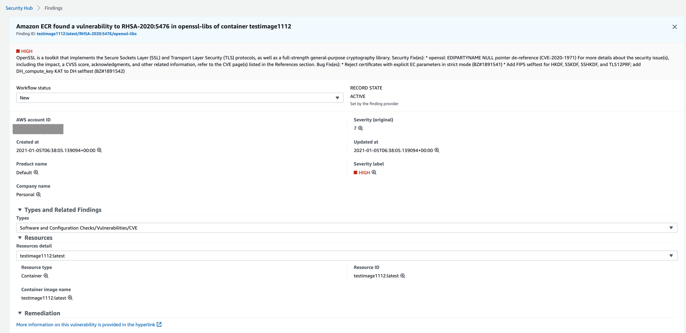

# Sending Amazon ECR Scan result to AWS Security Hub by ASFF format


## About

* This project assumes sending vulnerabilities of Amazon ECR Scanning to AWS Security Hub via ASFF format.
* Currently, Amazon ECR provides scanning vulnerabilities, but RCR cannot send AWS Security Hub.
* This project provides Lambda Python code to import scan data of Amazon ECR and send AWS Security Hub via ASFF format.

    * 

## Image

* Here is a image of this project.
* Amazon ECR --> CloudWatch Event --(Trigger)--> Lambda Function --> Security Hub
    * 
* Uses following boto3 function via Lambda
    * [ecr.describe_image_scan_findings](https://boto3.amazonaws.com/v1/documentation/api/latest/reference/services/ecr.html)
    * [securityhub.batch_import_findings](https://boto3.amazonaws.com/v1/documentation/api/latest/reference/services/securityhub.html)

## Install

* Upload Lambda code ([lambda_function.zip](https://github.com/hisnakad/AmazonECRScanSecurityHub/blob/main/lambda_function.zip)) to your Amazon S3 bucket.
* Run CloudFormation template ([ecr_scan.yaml](https://github.com/hisnakad/AmazonECRScanSecurityHub/blob/main/ecr_scan.yaml))
    * Check your S3 Bucket, uploaded Lambda function.
        * 
    * When you run the CloudFormation template, following resources will be created.
        * Lambda function
        * IAM role for Lambda function
        * CloudWatch Event - Amazon EventBridge, and triggered configuration at Lambda.
    * Please check the Lambda function and python code and event trigger.

## How to test

* When you finished install, this project will detect scan event of Amazon ECR and automatically sending vulnerabilities to SecurityHub as ASFF format.
* Try vulnerability scanning at AmazonECR, and check running Lambda function.
* The sample code detects "CRITICAL" and "HIGH" severities of vulnerabilities, and sendings ASFF format to AWS Security Hub.
    * 
* Check findings, Personal and Default in the findings of Security Hub. 
* Here is a sample ASFF Format
    * 

```
{
  "SchemaVersion": "2018-10-08",
  "Id": "test:latest/CVE-2020-10878/perl",
  "ProductArn": "arn:aws:securityhub:ap-northeast-1:123456789012:product/123456789012/default",
  "GeneratorId": "a8e50689-ce13-4a82-b7cd-6e9398d44712",
  "AwsAccountId": "123456789012",
  "Types": [
    "Software and Configuration Checks/Vulnerabilities/CVE"
  ],
  "CreatedAt": "2020-11-24T01:55:27.427134+00:00",
  "UpdatedAt": "2020-11-24T03:54:58.348508+00:00",
  "Severity": {
    "Product": 7,
    "Label": "HIGH",
    "Normalized": 70
  },
  "Title": "Amazon ECR found a vulnerability to CVE-2020-10878 in perl of container test",
  "Description": "Perl before 5.30.3 has an integer overflow related to mishandling of a \"PL_regkind[OP(n)] == NOTHING\" situation. A crafted regular expression could lead to malformed bytecode with a possibility of instruction injection.",
  "Remediation": {
    "Recommendation": {
      "Text": "More information on this vulnerability is provided in the hyperlink",
      "Url": "https://security-tracker.debian.org/tracker/CVE-2020-10878"
    }
  },
  "ProductFields": {
    "ProviderName": "Amazon ECR",
    "ProviderVersion": "v1.0",
    "aws/securityhub/FindingId": "arn:aws:securityhub:ap-northeast-1:123456789012:product/123456789012/default/securityhub-prowler:latest/CVE-2020-10878/perl",
    "aws/securityhub/ProductName": "Default",
    "aws/securityhub/CompanyName": "Personal"
  },
  "Resources": [
    {
      "Type": "Container",
      "Id": "securityhub-prowler:latest",
      "Partition": "aws",
      "Region": "ap-northeast-1",
      "Details": {
        "Container": {
          "ImageName": "securityhub-prowler:latest"
        },
        "Other": {
          "CVE ID": "CVE-2020-10878",
          "Installed Package": "perl 5.28.1-6",
          "CVSS2 Vector": "AV:N/AC:L/Au:N/C:P/I:P/A:P",
          "CVSS2 Score": "7.5"
        }
      }
    }
  ],
  "WorkflowState": "NEW",
  "Workflow": {
    "Status": "NEW"
  },
  "RecordState": "ACTIVE"
}
```

* * *
